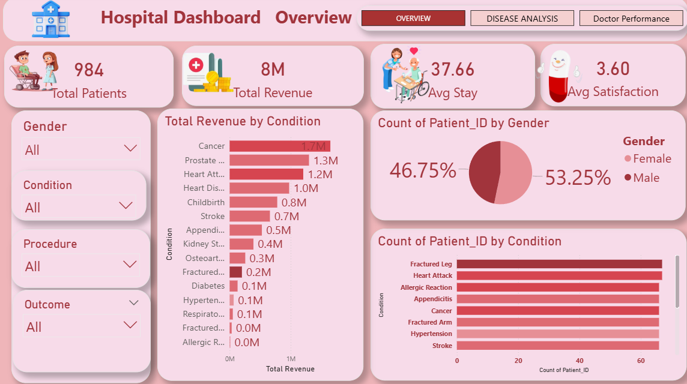
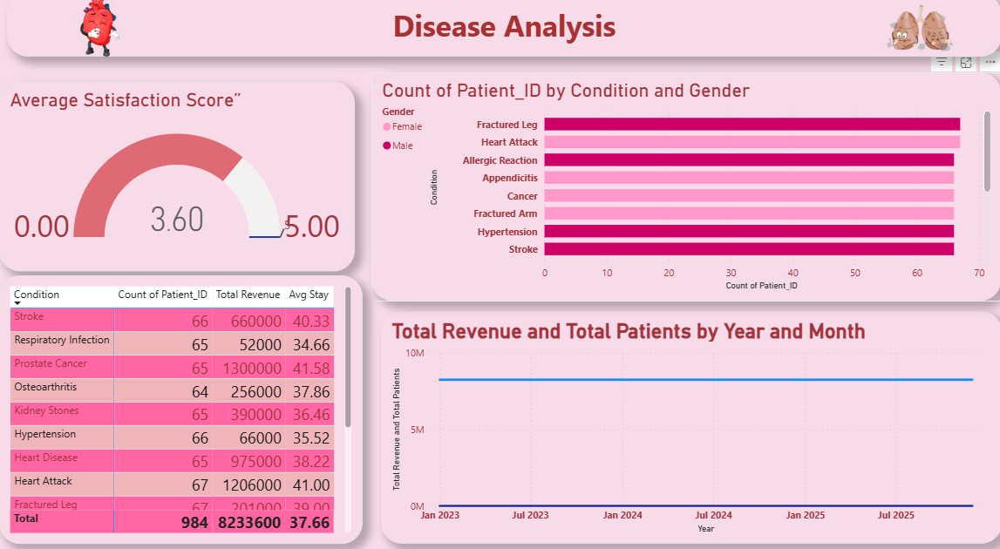
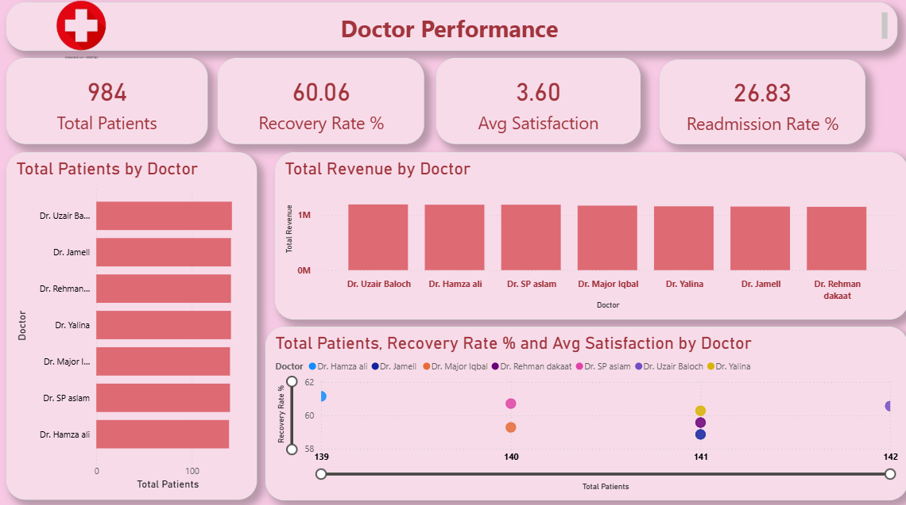

# 🏥 Hospital Analytics Dashboard

An interactive Hospital Analytics Dashboard built using **Power BI** to analyze hospital operations, diseases, patients, and doctor performance.

## 📊 Dashboard Overview

This project contains 3 interactive dashboard pages:

### 🏥 1. Hospital Overview

Provides an overall view of hospital performance, including key hospital and patient-related metrics.

---

### 🦠 2. Disease Analysis

Analyzes disease-related data to identify trends, patterns, and distribution of different diseases.

---

### 👨‍⚕️ 3. Doctor Performance

Analyzes doctor-related performance and helps understand performance patterns across doctors.

---

## 🛠️ Tools & Technologies

- Power BI
- Microsoft Excel
- Data Cleaning
- Data Analysis
- Data Visualization
- Dashboard Design

## ✨ Key Features

- Interactive Power BI dashboard
- Hospital performance analysis
- Disease analysis
- Doctor performance analysis
- Data visualization using charts and KPIs
- User-friendly dashboard design

## 📁 Project Files

| File | Description |
|------|-------------|
| `hospital-analytics-dashboard.pbix` | Power BI dashboard file |
| `hospital-overview.png` | Hospital Overview dashboard |
| `disease-analysis.png` | Disease Analysis dashboard |
| `doctor-performance.png` | Doctor Performance dashboard |

## 🎯 Project Objective

The objective of this project is to transform hospital data into meaningful visual insights that can help understand hospital performance, disease patterns, and doctor performance.

## 👤 Author

**Rohit Kumar**

Aspiring Data Analyst

**Skills:** Python | SQL | Power BI | Advanced Excel | Tableau | Pandas | NumPy | Matplotlib
